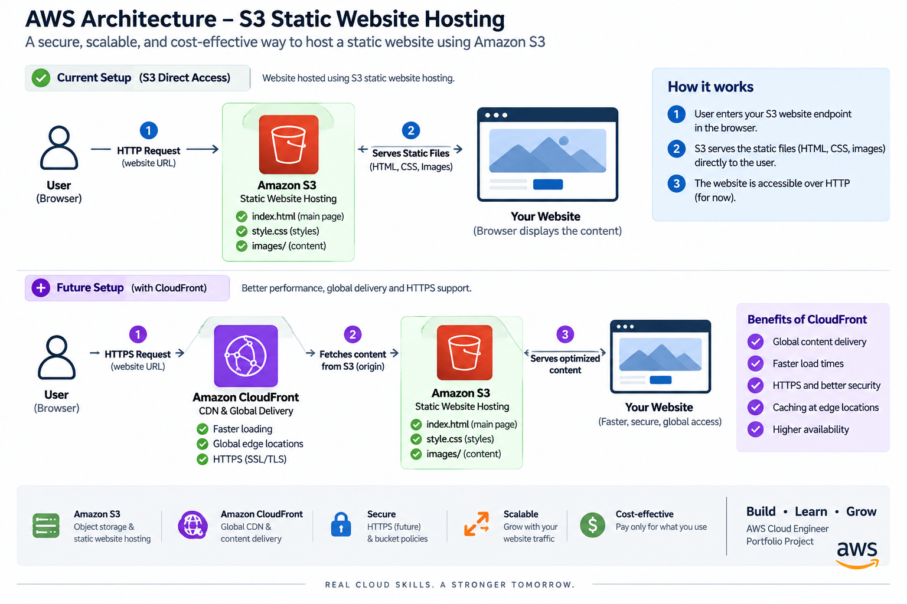

\# AWS S3 Static Website — Cloud Engineer Portfolio

A professional cloud engineer portfolio website hosted using Amazon S3 Static Website Hosting.

The project demonstrates AWS cloud fundamentals including Amazon S3, IAM, CloudFront, static website hosting, object storage and cloud-based content delivery.

\---

\## 🚀 Live Website

\### Amazon S3 Website

http://siddarth-static-website-2026.s3-website.ap-south-1.amazonaws.com

\### CloudFront

CloudFront distribution will be added after AWS account verification is completed.

\---

## ☁️ Architecture

The current architecture uses Amazon S3 Static Website Hosting to serve the portfolio website directly to visitors.

### How It Works

1. The user accesses the Amazon S3 website endpoint.
2. Amazon S3 serves `index.html` as the main webpage.
3. The browser loads `style.css` for the website design.
4. Certificate and badge images are loaded from the `images/` folder.
5. The S3 bucket policy provides public read access to the website files.

### Future Architecture — CloudFront

CloudFront is planned as the next stage of the project after AWS account verification is completed.